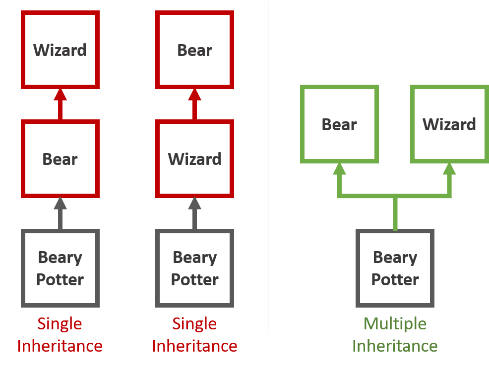

**mxObject**
========

**Mixable and eXtensible objects in JavaScript**

----------

**Overview of JS Inheritance**
-------

Inheritance in JavaScript is achieved via the **prototype chain**. Each object may have a prototype from which it inherits some additional behavior (in the form of additional properties). An object's prototype is just another object which, in turn, has its own prototype. Even though **an object can only have *one* prototype**, because of this chaining effect, objects not only inherit behavior from their own prototype, but every prototype in the prototype chain until eventually you hit an object with no prototype (usually, Object.prototype). 

JavaScript prototypal inheritance is...

 - **Single Inheritance** 
 - **Multi-level Inheritance**
 - **Live Inheritance**

The 1st bullet makes composition impossible and can force a programmer into logical inconsistencies to achieve a desired behavior. These restrictions do not exist in systems that allow multiple inheritance. 

As an example, consider Beary Potter who is both a Bear and a Wizard. With single inheritance, if you want Beary Potter to inherit from both Bear AND Wizard, either Bear must inherit from Wizard or Wizard must inherit from Bear. Obviously, this is ridiculus. Multiple inheritance allows you to compose Bear and Wizard in order to create Beary Potter who is both.

 <em>Not all bears are wizards. Not all wizards are bears. Beary Potter is both.</em>

The 3rd bullet item, "Live Inheritance", is simultaneously awesome and awful. Any changes to a prototype property is "automagically" changed in all objects which contain that prototype in its prototype chain. This is awesome because you can have a whole bunch of objects share the same behavior. Changing the prototype behavior changes the behavior of all of the other objects. Yet, this is awful in that prototypes provide no way to simply stamp out instances of the prototype. To stamp out instances, you have to use the **new keyword** and a **Constructor** function (which then lets you keep some live properties by matching the constructor's prototype property with an instance's internal prototype).  Personally, I don't like the *feel* of new keyword and constructors (and by extension, ES6 classes). To me it seems like a square peg forced into the round hole that is the rest of JS for the purpose of trying to replicate the instancing functionality that exists in OOP classes.

**What does mxObject do differently?**
--------------------------------------

A mxObject *(pronounced mix object)* has two ways to inherit functionality (ie. properties) from another mxObject, object, or array: mixins and extensions. A mxObject can inherit from multiple mixins, multiple extensions, or any combination of mixins and extensions. 

**Mixins**

A mxObject maintains a list of mixed-in, "mixin" objects in an internal array [ .\__mixins__ ]. Accessing properties from mixed-in objects is virtually identical to accessing properties from objects in the prototype chain. The mxObject looks for a property on itself. If it doesn't find it, it checks each element in its mixin array. If the property is found on a mixin, it is returned. This process does NOT rely on JavaScript prototypes, so successive elements in the mixin array do NOT inherit from one another. 

 - Mixins provide **single-level, multiple inheritance**
 - Mixin inheritance is "live" in the same way that prototypical inheritance is "live"

**Extensions** 

Extending a mxObject with another mxObject, object, or array simply **copies all properties** of the extension onto the mxObject. In fact, the mxObject.extend( ) is virtually identical to Object.assign( ) (and uses Object.assign( ) in it's implementation). The primary difference between Object.assign( ) and mxObject.extend( ) is that mxObjects maintain an internal array of extensions [ .\__extensions__ ].  This allows you to check if a mxObject has been extended from another object with mxObject.isExtensionOf( ) -- this is not possible using plain Object.assign( ). 

 - Extensions provide **instance-like, stamping/copying of properties**
 - mxObjects maintain a history of extensions
 - Extensions can be overwritten
 - Extensions can be re-extended
